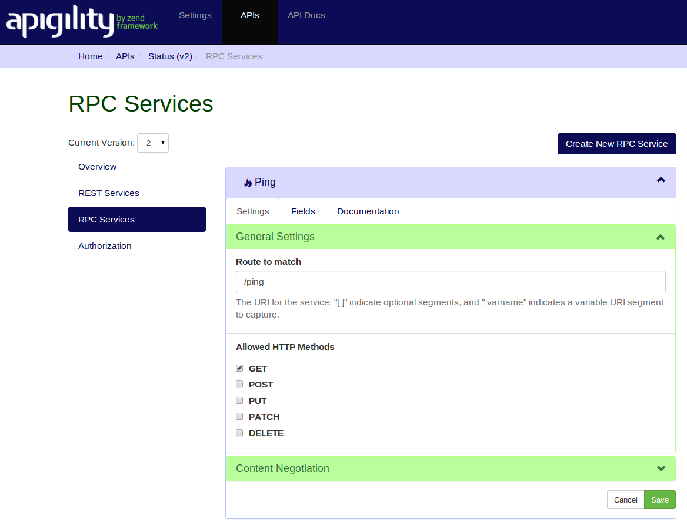
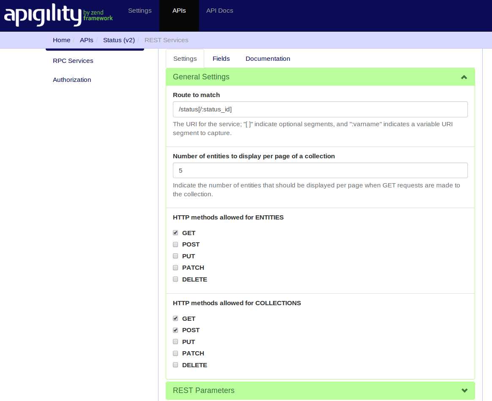

HTTP Method Negotiation
=======================

If your API is to adhere to the [Richardson Maturity Model](http://martinfowler.com/articles/richardsonMaturityModel.html)
Level 2 or higher, you will be using HTTP verbs to interact with it: `GET`, `POST`, `PUT`, `DELETE`,
and `PATCH` being the most common.  However, based on the resource and whether or not the end point
is a collection, you may want to allow different HTTP methods. How can you do that? and how do you
enforce it?

HTTP provides functionality around this topic via another HTTP method, `OPTIONS`, and a related HTTP
response header, `Allow`.

Calls to `OPTIONS` are non-cacheable, and may provide a response body if desired. They _should_
emit an `Allow` header, however, detailing which HTTP request methods are allowed on the current
URI.

Consider the following request:

```HTTP
OPTIONS /api/user HTTP/1.1
Host: example.org
```

with its response:

```HTTP
HTTP/1.1 200 OK
Allow: GET, POST
```

This tells us that for the URI `/api/user`, you may emit either a `GET` or `POST` request.

What happens if a malicious user tries something else? You should respond with a `405 Not Allowed`
status, and indicate what _is_ allowed:

```HTTP
HTTP/1.1 405 Not Allowed
Allow: GET, POST
```

Apigility takes care of these details for you. For each service, you can indicate which HTTP methods
to respond to (and, in the case of REST services, also separate those calls by whether an entity is
being addressed, or a collection); Apigility will then respond to `OPTIONS` requests, and return
`405` statuses for invalid HTTP methods.

As an example, the following RPC service indicates only the `GET` method is available:



The next example is of a REST service. REST services can respond for either collections (the URI
without an identifier) or entities (the URI _with_ an identifier). As such, you need to configure
two sets of HTTP methods:



In the above case, when accessing the collection, you can use either `GET` or `POST`, but when
accessing an individual item in the collection (an entity), only `GET` is allowed.
